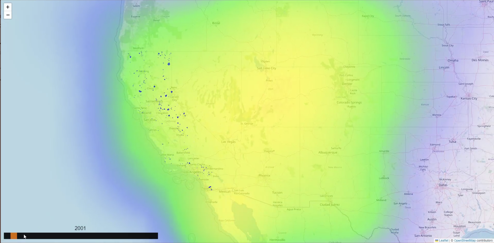
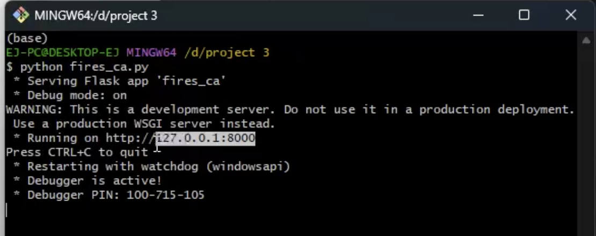

# project_3
Topic: 
For project 3 we are looking to see the connection between the increase in global temperature and the abundance of California wildfires over different years. The goal is to map the size of fire per year per recorded fire, and correlate that with the increase of temperature.


## Setup

This project has a server built in Flask that provides two endpoints:

1.- /api/v1.0/temperatures/&lt;year_>

2.- /api/v1.0/find_features/&lt;year>

The first endpoint returns temperatures per year, and the second one returns fire incidents per year. This server also provides a web view, which is an interactive map that loads information from georeferenced polygons of fires and climate change on Earth, obtained from the aforementioned endpoints.
As shown in the following image:


### Requirements
- Mongodb
- Python 3.X
- Jupyter
#### Python packages
From pip:
- pymongo
- flask
- bson
- pandas
- matplotlib
- numpy
- plotly

#### About Mongodb
The mongo dataset must be imported from: **_firemap/db/fires_cal_features_mongo.json_**

Using the following command:
```shell
mongoimport --type json -d fires_cal -c features --drop --jsonArray firemap/db/fires_cal_features_mongo.json
```
#### About Server

To run the server, make sure you have imported the datasets into MongoDB and are inside the project root directory. Finally, execute the following command:
```
python ./fires_ca.py
```


After visit the following URL:
```
http://127.0.0.1:8000
```
You must see the map, as shown in the following image:

